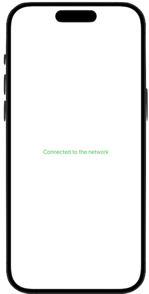

# Modern Swift Reachability
A Swift utility class that allows a SwiftUI app to monitor and react to network status changes in real-time using modern Swift Concurrency.

## The NetworkMonitor Class
- Uses @MainActor to ensure that all property updates occur on the main thread.
- Uses URLSession with waitsForConnectivity to wait for network connectivity before making a request.
- startMonitoring method asynchronously checks connectivity and updates the isConnected property.
- The checkConnectivity method performs a network request to check if a connection is available.

## ContentView
- Uses @StateObject property wrapper for the NetworkMonitor singleton.
- Uses the .task modifier to call startMonitoring asynchronously when the view appears.

## Sample Project
The [reachability example app](./reachability/) uses the utility class.

For more see the [Apple documentation on the Network framework](https://developer.apple.com/documentation/network).
