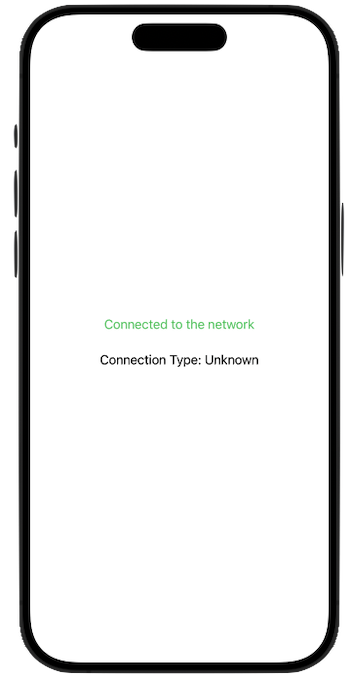

# Modern Swift Reachability
A Swift utility class that allows a SwiftUI app to monitor and react to network status changes in real-time using modern Swift Concurrency.

## The NetworkMonitor Class
-	The class is marked with @MainActor to ensure all property updates are performed on the main thread.
-	The startMonitoring method uses a Task to update properties on the main thread.
-	The pathUpdateHandler closure is updated to use Task and @MainActor.

## ContentView
-	The @StateObject property wrapper is used for the NetworkMonitor singleton.
-	The .task modifier is used to call startMonitoring asynchronously when the view appears.

## Sample Project
The [reachability example app](./reachability/) uses the utility class.

For more see the [Apple documentation on the Network framework](https://developer.apple.com/documentation/network).
